# Manuel utilisateur — PertFlow

**PertFlow** est un outil de planification **PERT** qui fonctionne entièrement dans votre
navigateur, **sans installation ni serveur**. Vous construisez visuellement un réseau de tâches
et de jalons reliés par des dépendances ; PertFlow calcule automatiquement les dates, les marges
et le chemin critique, puis vous permet d'exporter le résultat (image, PDF, Excel, MS Project…).

- **100 % hors ligne** : il suffit d'ouvrir le fichier `pertflow.html` par un double-clic.
  Aucune connexion réseau n'est requise.
- **Aucune donnée n'est envoyée** : tout reste sur votre poste.

> **Vocabulaire.** Un planning PertFlow est constitué de **nœuds** — les boîtes posées sur la zone
> de dessin (le *canvas*) — reliés par des **liens** (les dépendances). Il existe **trois types de
> nœuds** : **Activité** (une *tâche*, qui a une durée), **Jalon** (une échéance instantanée) et
> **Label** (une note libre). Dans ce manuel, « **tâche** » désigne toujours un nœud **Activité**,
> et les boutons **▭ Activité / ◈ Jalon / ❏ Label** de la barre d'outils créent ces trois types
> de nœuds.

> 💡 Ce manuel illustre l'application avec un projet d'exemple « Nouveau produit ».

---

## Table des matières

1. [Prise en main rapide (quick start)](#1-prise-en-main-rapide-quick-start)
2. [L'interface](#2-linterface)
3. [Les types de nœuds](#3-les-types-de-nœuds)
4. [Le moteur de calcul PERT](#4-le-moteur-de-calcul-pert)
5. [Le panneau Propriétés](#5-le-panneau-propriétés)
6. [Organisation et lisibilité du planning](#6-organisation-et-lisibilité-du-planning)
7. [Regroupement métier (groupes et couleurs)](#7-regroupement-métier-groupes-et-couleurs)
8. [Estimation des coûts](#8-estimation-des-coûts)
9. [Importer un planning Excel existant](#9-importer-un-planning-excel-existant)
10. [Sauvegarde, ouverture et récupération](#10-sauvegarde-ouverture-et-récupération)
11. [Exporter le planning](#11-exporter-le-planning)
12. [Les paramètres du projet](#12-les-paramètres-du-projet)
13. [Raccourcis clavier](#13-raccourcis-clavier)
14. [Questions fréquentes](#14-questions-fréquentes)

---

## 1. Prise en main rapide (quick start)

Objectif : créer un premier PERT en quelques minutes.

1. **Ouvrez PertFlow** (double-clic sur `pertflow.html`).
2. **Réglez la date de début et l'unité** : cliquez sur **⚙ Paramètres**, saisissez la
   **Date de début (T0)** de votre projet et l'**unité de durée** (jours, semaines ou mois),
   puis **Valider**.
3. **Ajoutez une tâche** : cliquez sur **▭ Activité** dans la barre d'outils. Un nœud apparaît
   au centre. Il est sélectionné : le **panneau Propriétés** (à droite) affiche ses champs.
4. **Renseignez la tâche** : dans le panneau, saisissez le **Libellé** (nom de la tâche) et la
   **Durée**. Ajoutez au besoin un **Responsable**, un **Groupe** et une **couleur**.
5. **Ajoutez d'autres tâches** et reliez-les : tirez un trait depuis le **point de sortie**
   (à droite d'un nœud) vers le **point d'entrée** (à gauche) d'un autre nœud pour créer une
   **dépendance** (« celui-ci doit finir avant que celui-là commence »).
6. **Ajoutez un jalon de fin** : cliquez sur **◈ Jalon**, reliez-y la dernière tâche, et
   donnez-lui éventuellement une **date-cible** à tenir.
7. **Lisez les résultats** : chaque tâche affiche sa **date de fin au plus tôt** et sa
   **marge**. Le **chemin critique** est tracé en **rouge**. La **barre de statut** (en bas)
   indique la fin de projet, le nombre de tâches et les coûts.
8. **Rangez le planning** : cliquez sur **⤓ Réorganiser** pour un placement chronologique
   automatique, puis **🔍 Tout afficher** pour cadrer l'ensemble à l'écran.
9. **Sauvegardez** : cliquez sur **💾 Sauvegarder** pour télécharger votre projet au format
   `.pert` (rechargeable plus tard via **📂 Ouvrir**).

Vous savez désormais construire un PERT. Les sections suivantes détaillent chaque fonctionnalité.

---

## 2. L'interface

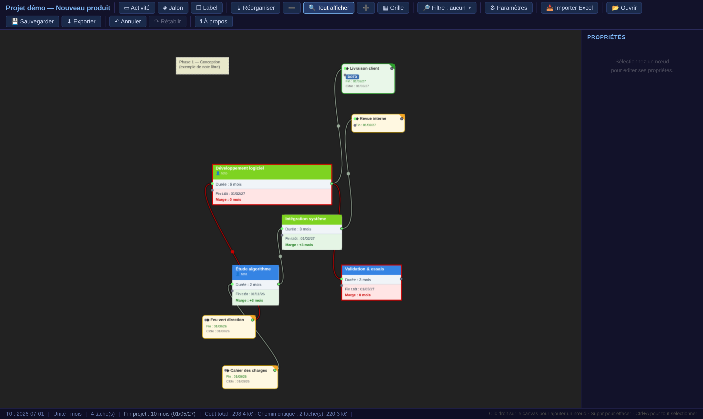

L'écran se compose de quatre zones :

- **La barre d'outils** (en haut) — tous les boutons d'action (voir ci-dessous).
- **Le canvas** (au centre) — la zone de dessin où vivent les nœuds et leurs liens.
- **Le panneau Propriétés** (à droite) — les champs du nœud sélectionné (voir §5).
- **La barre de statut** (en bas) — T0, unité, nombre de tâches, fin de projet, coûts, et un
  rappel des principales actions.

### Les boutons de la barre d'outils

| Bouton | Rôle |
|---|---|
| **▭ Activité** | Ajoute une tâche (voir §3). |
| **◈ Jalon** | Ajoute un jalon (échéance / point de contrôle). |
| **❏ Label** | Ajoute une zone de texte libre (documentation). |
| **⤓ Réorganiser ▾** | Range automatiquement les nœuds. Ouvre un menu à **deux modes** : *chronologique complète* ou *axe du temps seul* (voir §6). |
| **➖ / ➕** | Dézoome / zoome (utile sans molette de souris). |
| **🔍 Tout afficher** | Ajuste le zoom pour voir tout le planning. |
| **▦ Grille** | Active/désactive la grille aimantée (alignement des nœuds au déplacement). |
| **🔎 Filtre** | Met en évidence un groupe, une couleur ou un responsable (voir §6). |
| **⚙ Paramètres** | Ouvre les réglages du projet (T0, unité, styles, coûts…). |
| **📥 Importer Excel** | Importe un planning Excel existant (voir §9). |
| **📂 Ouvrir** | Charge un fichier `.pert`. |
| **💾 Sauvegarder** | Télécharge le projet au format `.pert`. |
| **⬇ Exporter** | Ouvre la fenêtre d'export (image, PDF, Excel, MS Project…). |
| **↶ Annuler / ↷ Rétablir** | Annule / rétablit la dernière action (Ctrl+Z / Ctrl+Y). |
| **ℹ À propos** | Auteur, licence et version. |

### Se déplacer dans le canvas

- **Déplacer la vue** : cliquez-glissez sur le fond vide.
- **Zoomer** : molette de la souris (ou boutons ➖/➕).
- **Déplacer un nœud** : cliquez-glissez sur le nœud.
- **Sélection multiple** : cliquez-glissez sur le fond pour tracer un rectangle de sélection,
  ou `Ctrl+A` pour tout sélectionner. Pour **déplacer tout un groupe** sélectionné, cliquez-glissez
  simplement l'un de ses éléments (les autres suivent).
- **Clic droit** : menu contextuel (ajouter un nœud sous le curseur, réorganiser, **aligner une
  sélection**… voir §6).

---

## 3. Les types de nœuds

### Nœud Activité (tâche)

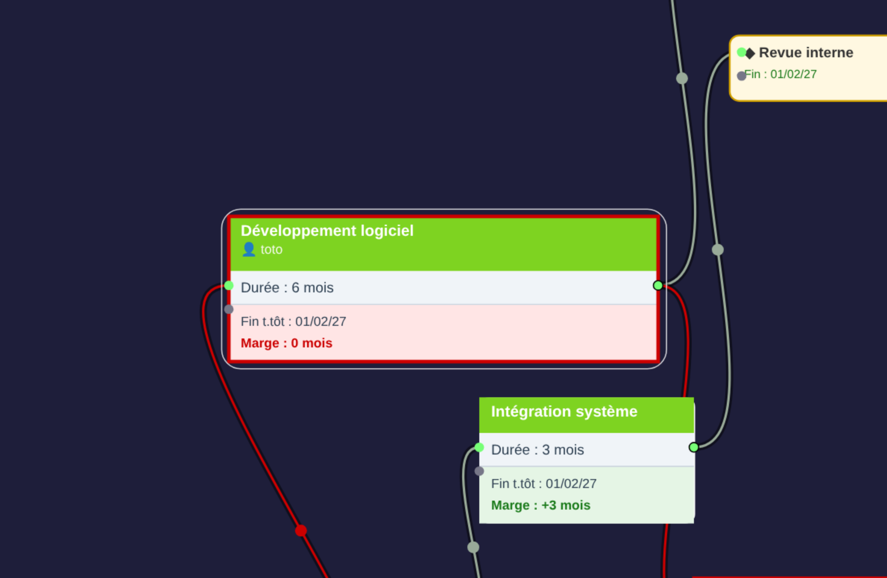

Une **Activité** représente une tâche qui **prend du temps** (une durée). Elle se lit ainsi :

- **En-tête coloré** : le nom de la tâche + le **responsable** (précédé de 👤). La couleur
  reflète le **groupe** métier (voir §7).
- **Durée** : exprimée dans l'unité du projet (jours, semaines ou mois).
- **Fin t.tôt** : la **date de fin au plus tôt** calculée (voir §4).
- **Marge** : le nombre d'unités de « jeu » avant que la tâche ne retarde le projet.
  - Fond **vert** = il reste de la marge.
  - Fond **rouge** + **bordure rouge** = marge nulle → la tâche est **sur le chemin critique**
    (tout retard décale la fin du projet).

### Nœud Jalon

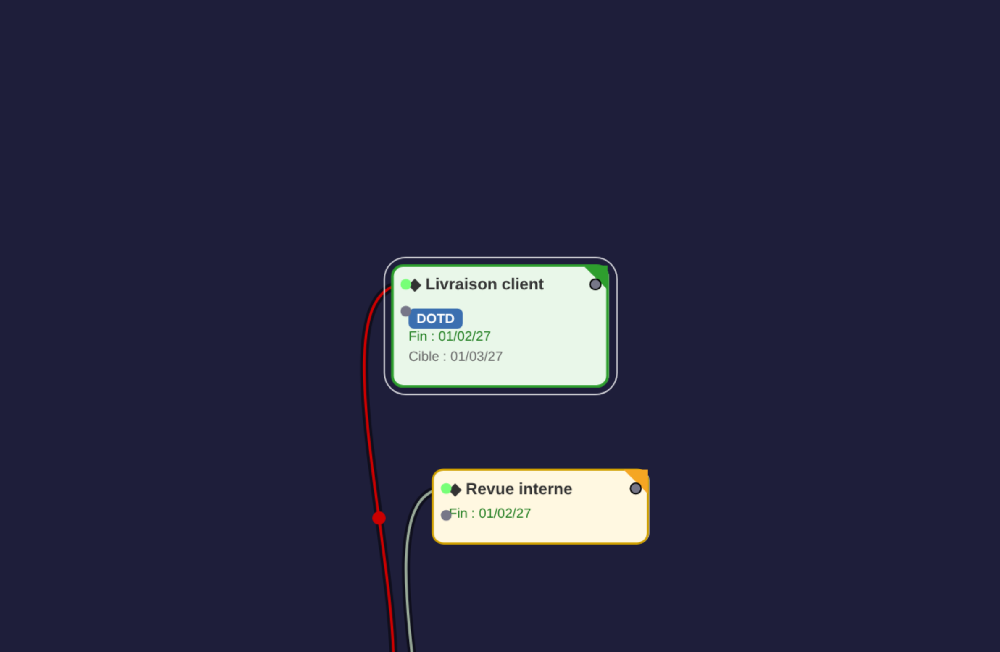

Un **Jalon** est un **point instantané** (durée nulle) : une échéance, une livraison, une revue.
Il se reconnaît à sa forme arrondie avec un **coin « drapeau »** et un losange ◆ devant son nom.
Il peut porter :

- une **date-cible** (« Cible ») à tenir ;
- un **tag** de type (aucun / **DOTD** / **COTD** / **Ingénierie**), affiché sous forme de
  **pastille colorée** — utile pour marquer les jalons contractuels majeurs.

Le coin du jalon change de couleur selon la **tenue de la cible** :
**vert** (tenue confortablement), **orange** (juste tenue) ou **rouge** (ratée).

> Les rôles des jalons (entrant, sortant, point de contrôle) et la notion de cible sont
> détaillés au §4.

### Nœud Label

Un **Label** est une simple **zone de texte** (rectangle en pointillés) pour documenter le
planning (titre de phase, hypothèse, légende…). Il n'a **pas de lien** et **n'entre pas** dans
le calcul PERT.

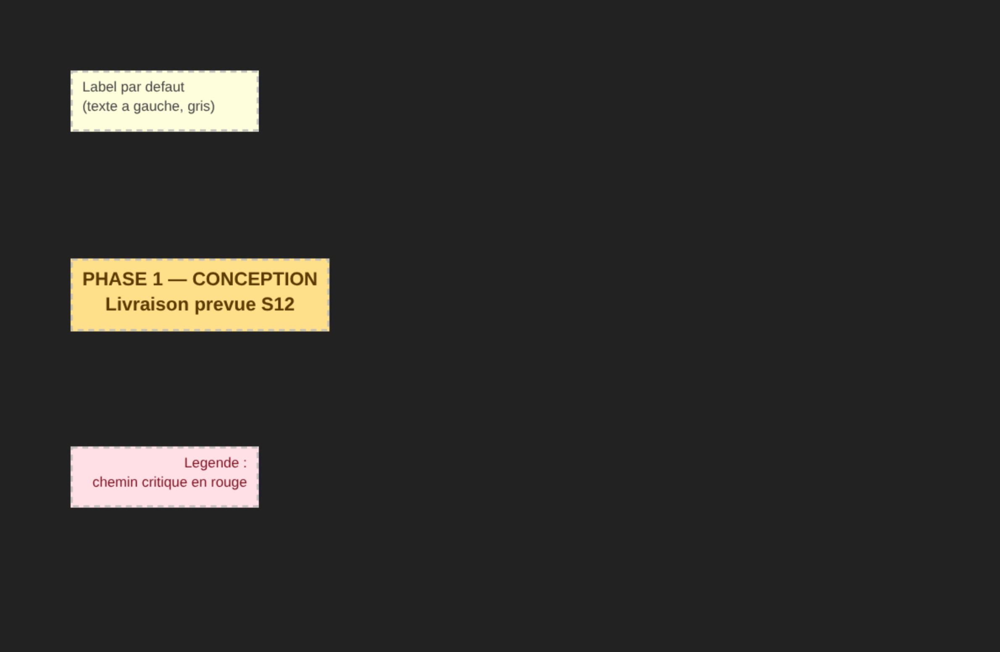

Un Label se **met en forme** librement (les réglages sont dans le panneau Propriétés, voir §5) —
c'est une aide **visuelle**, sans aucun effet sur le calcul :

- **Taille du texte** — boutons **− / +**.
- **Alignement du texte** — **gauche**, **centré** ou **droite**.
- **Texte en gras** — case à cocher, applique le gras à tout le texte.
- **Couleur du texte** et **couleur du fond** de l'encadré, indépendamment l'une de l'autre.

> À la différence de la couleur d'une **tâche** (qui sert à regrouper et à filtrer, voir §7), la
> couleur d'un Label est **purement décorative** : elle n'entre dans **aucun filtre**.

Vous pouvez aussi **redimensionner** un Label à la main (poignée en bas à droite) : sa taille est
alors **figée** et n'est plus recalculée automatiquement quand vous éditez le texte.

---

## 4. Le moteur de calcul PERT

C'est le cœur de PertFlow : à partir des durées et des dépendances, il calcule automatiquement
**quand** chaque tâche peut/doit se dérouler, et **où sont les marges de manœuvre**. Le calcul
est **recalculé en continu** à chaque modification.

### T0 et unités

- **T0** est la **date de début du projet** (réglée dans Paramètres).
- L'**unité** de durée est **jours**, **semaines** ou **mois** :
  - jours et semaines sont des durées exactes (1 semaine = 7 jours) ;
  - les **mois** sont des **mois calendaires réels** (les longueurs de mois et les années
    bissextiles sont gérées) — important pour les projets longs.

En interne, PertFlow raisonne en **unités depuis T0**, puis convertit en **dates calendaires**
pour l'affichage.

### Dates au plus tôt / au plus tard, marges

Pour chaque tâche, PertFlow calcule quatre repères :

- **Début au plus tôt (ES)** = la date la plus précoce à laquelle la tâche peut commencer =
  la **plus tardive des fins** de ses prédécesseurs.
- **Fin au plus tôt (EF)** = ES + durée.
- **Fin au plus tard (LF)** = la date à ne pas dépasser sans retarder le projet.
- **Début au plus tard (LS)** = LF − durée.

La **Marge** (slack) = **LF − EF** : le « jeu » disponible.

> Ces quatre repères (ES / EF / LS / LF), la marge et le coût estimé sont visibles dans la
> section **Chemin critique** du panneau Propriétés lorsqu'une tâche est sélectionnée (voir §5).

### Le chemin critique

Le **chemin critique** est la **chaîne de tâches sans marge** : tout retard sur l'une d'elles
retarde la fin du projet. PertFlow le trace **en rouge** :

- **sans sélection**, c'est le chemin de **marge minimale** de l'ensemble du projet ;
- **quand vous sélectionnez une tâche**, PertFlow trace le chemin **contraignant** qui aboutit
  à cette tâche (pratique pour comprendre « qu'est-ce qui pilote cette date ? »).

La barre de statut indique le **nombre de tâches** du chemin critique et son **coût**.

### Les jalons : entrants, sortants, points de contrôle

Un jalon se comporte différemment selon **sa position dans le réseau** — c'est une subtilité
importante :

- **Jalon entrant** (aucun lien entrant, au moins un lien sortant, et une **date-cible**) :
  il modélise une **contrainte externe** qui **amorce** une chaîne — par exemple la livraison
  d'un prototype, un feu vert de la direction, un jalon fournisseur. Sa date-cible **fixe le
  démarrage** des tâches en aval (elles ne partent pas à T0, mais à cette date). Dans l'exemple,
  « Cahier des charges » et « Feu vert direction » sont des jalons entrants.
- **Jalon de sortie / terminal** (avec des liens entrants) : il marque une **échéance** en bout
  de chaîne. Sa date-cible **borne la fin au plus tard** (LF) mais **ne force pas** son démarrage.
- **Point de contrôle intermédiaire** (jalon au milieu d'une chaîne) : sa date-cible ne fait que
  **borner le LF** ; son début reste piloté par la fin de ses prédécesseurs.

### La date-cible (« Cible ») et sa tenue

Quand un jalon porte une **date-cible**, PertFlow compare la date **calculée** à la **cible** :

- si la cible est **tenue avec une marge confortable** → coin/pastille **vert** ;
- si elle est **juste tenue** → **orange** ;
- si elle est **ratée** (le calcul dépasse la cible) → **rouge**, alerte visuelle.

> ⚠️ Une **marge négative** signifie qu'une échéance imposée est **infaisable** en l'état :
> elle s'affiche en rouge pour vous alerter.

### Les cycles

Un réseau PERT doit être **acyclique** (pas de boucle de dépendances). Si vous créez un cycle
par erreur, PertFlow le **détecte** et l'indique dans la barre de statut, sans planter — corrigez
le lien fautif et le calcul reprend.

---

## 5. Le panneau Propriétés

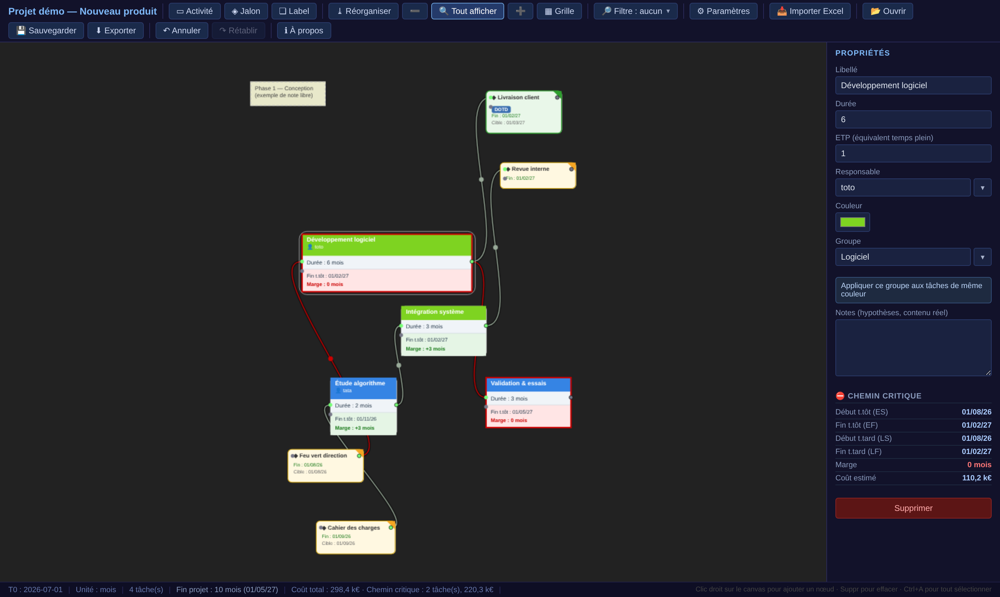

Le panneau (à droite) affiche les champs du nœud sélectionné. Pour une **Activité** :

- **Libellé** — le nom de la tâche.
- **Durée** — dans l'unité du projet.
- **ETP** (Équivalent Temps Plein) — l'effort estimé, utilisé pour le **coût** (voir §8).
- **Responsable** — liste déroulante enrichissable (les noms déjà saisis sont reproposés).
- **Couleur** — couleur de fond du nœud.
- **Groupe** — le WP / métier / service (voir §7), avec le bouton
  **« Appliquer ce groupe aux tâches de même couleur »**.
- **Notes** — texte libre (hypothèses, contenu réel de la tâche). Les notes restent dans le
  panneau et ne sont **jamais** affichées sur le nœud.
- **Section Chemin critique** — les repères calculés (ES / EF / LS / LF), la **marge** et le
  **coût estimé** (lecture seule).
- **Supprimer** — supprime le nœud.

Pour un **Jalon**, le panneau propose le libellé, la **date-cible**, le **type de jalon**
(tag) et une zone de **Notes** libres (panneau uniquement).

Pour un **Label**, le panneau réunit la zone de **texte** et tous ses réglages de mise en forme :

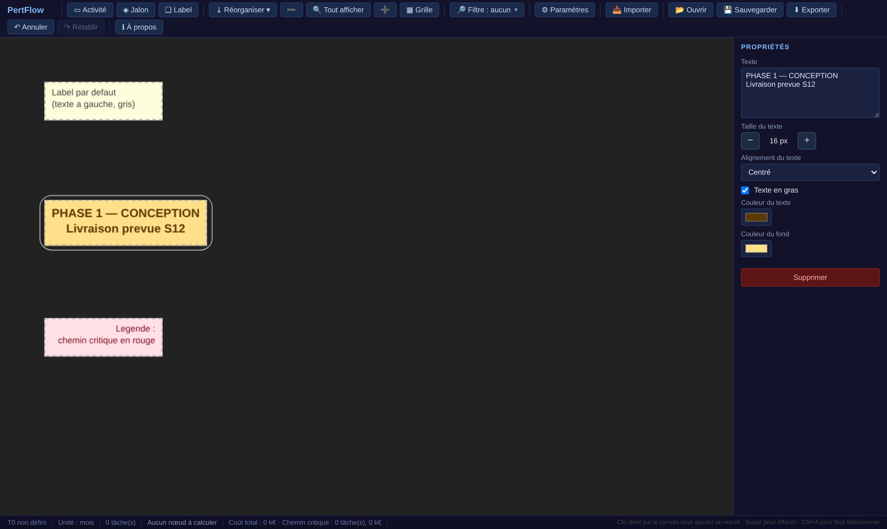

- **Texte** — le contenu (multi-lignes).
- **Taille du texte** — boutons **− / +**.
- **Alignement du texte** — gauche / centré / droite.
- **Texte en gras** — case à cocher.
- **Couleur du texte** / **Couleur du fond** — deux sélecteurs de couleur.

> Chaque modification recalcule immédiatement le planning (les réglages purement visuels d'un
> Label, eux, n'ont aucun effet sur le calcul).

---

## 6. Organisation et lisibilité du planning

### Réorganiser (deux modes)

Le bouton **⤓ Réorganiser** ouvre un **menu à deux modes**. Le déclenchement est toujours
**manuel** : votre placement à la main n'est jamais bousculé tant que vous ne choisissez pas
un mode.

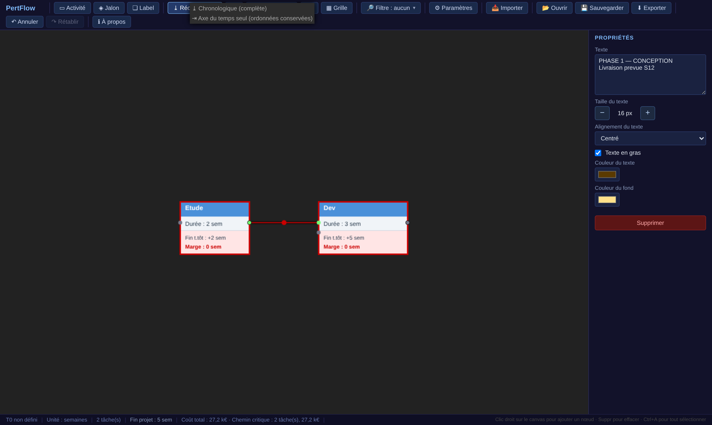

- **Chronologique (complète)** — range les nœuds **horizontalement** par ordre chronologique
  (abscisse ∝ date au plus tôt) **et** les répartit **verticalement** pour éviter toute
  superposition, façon diagramme de Gantt. Les enchaînements de tâches reliées restent groupés.
- **Axe du temps seul (ordonnées conservées)** — ne recale que l'**abscisse** (le temps) et
  **conserve la hauteur** (l'ordonnée) que vous avez donnée à chaque nœud, quitte à laisser des
  chevauchements. Idéal quand vous avez soigné un placement vertical (une ligne par équipe, par
  zone…) et voulez seulement « recaler les dates » sans casser votre disposition.

L'exemple ci-dessous illustre le mode **axe du temps seul** : à gauche, deux rangées disposées
à la main mais dont les abscisses ne correspondent pas aux dates ; à droite, après réorganisation,
les abscisses sont recalées sur le temps **tandis que les deux rangées sont conservées** (la tâche
« Documentation » reste sur sa ligne du bas).

| Avant | Après (axe du temps seul) |
|---|---|
| 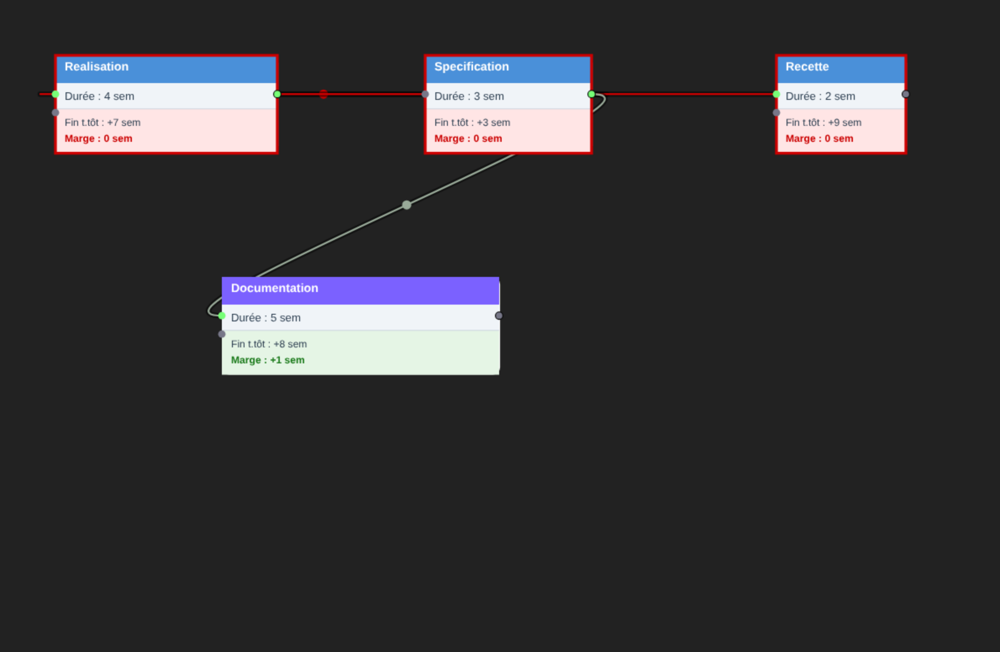 | 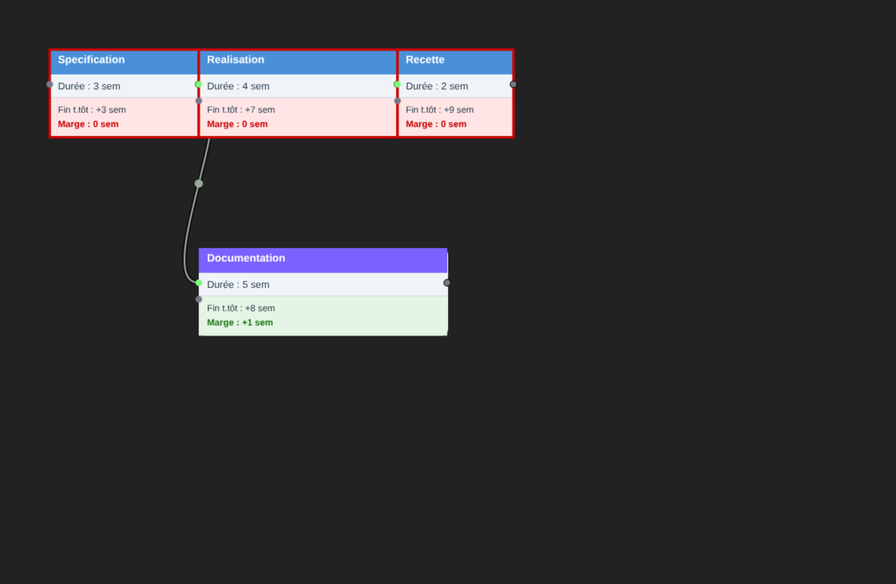 |

### Aligner et répartir une sélection

Pour soigner la présentation, sélectionnez **plusieurs nœuds** (rectangle de sélection ou `Ctrl`+clic),
puis **clic droit → ⊞ Aligner**. Un menu propose les opérations classiques d'un outil de dessin :

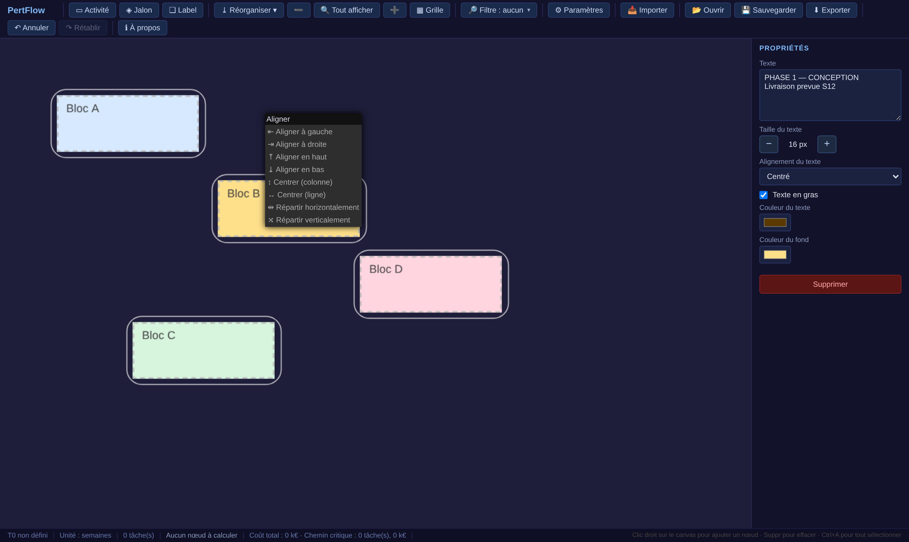

- **Aligner à gauche / à droite / en haut / en bas** — cale les nœuds sur un même bord.
- **Centrer (colonne)** — aligne les centres sur une même verticale.
- **Centrer (ligne)** — aligne les centres sur une même horizontale.
- **Répartir horizontalement / verticalement** — égalise l'espacement entre les nœuds
  (à partir de **trois** nœuds sélectionnés).

Exemple : quatre blocs éparpillés, puis **alignés à gauche et répartis verticalement**.

| Avant | Après (aligner à gauche + répartir verticalement) |
|---|---|
| 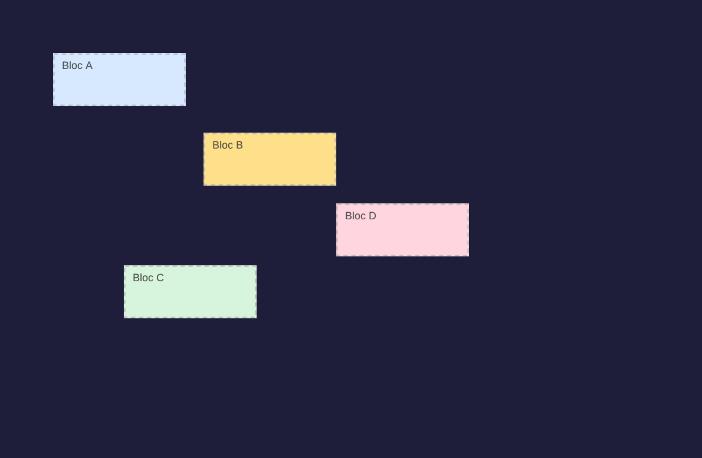 |  |

> Ces opérations ne déplacent que la **présentation** : elles n'ont aucun effet sur le calcul PERT
> (les dates et le chemin critique ne dépendent pas de la position des nœuds). Un **Ctrl+Z** annule.

### La grille aimantée

**▦ Grille** active un alignement automatique des nœuds sur une grille lors de leur déplacement
(la grille n'est visible que lorsque l'option est active).

### Le style des liens

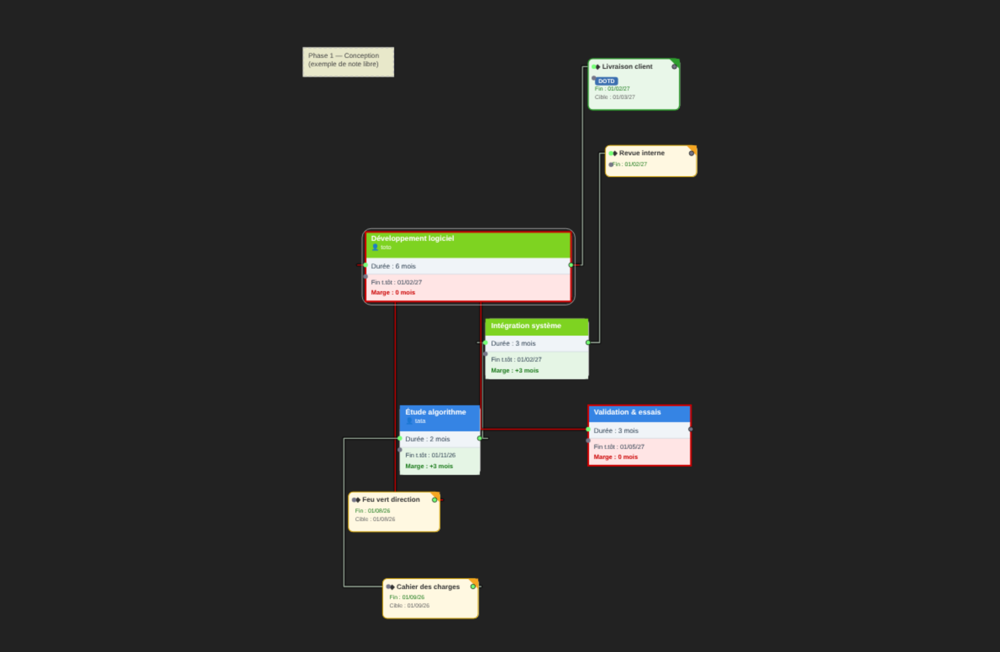

Dans **Paramètres → Style des liens**, trois rendus au choix :

- **Courbe** (par défaut) — liens en courbes douces.
- **Droit** — liens quasi rectilignes.
- **Coudé** — liens à **angles droits** qui **contournent** les tâches situées sur leur trajet
  (les liens ne passent plus « sous » les nœuds). Idéal pour un PERT dense.

> Déplacer une tâche **ne bouge jamais** les autres nœuds : seuls les liens se re-tracent en
> direct. Et lorsque vous **tirez un lien** pour connecter deux nœuds, le trait suit simplement
> le curseur (visée fluide).

### Le filtre (mettre en évidence)

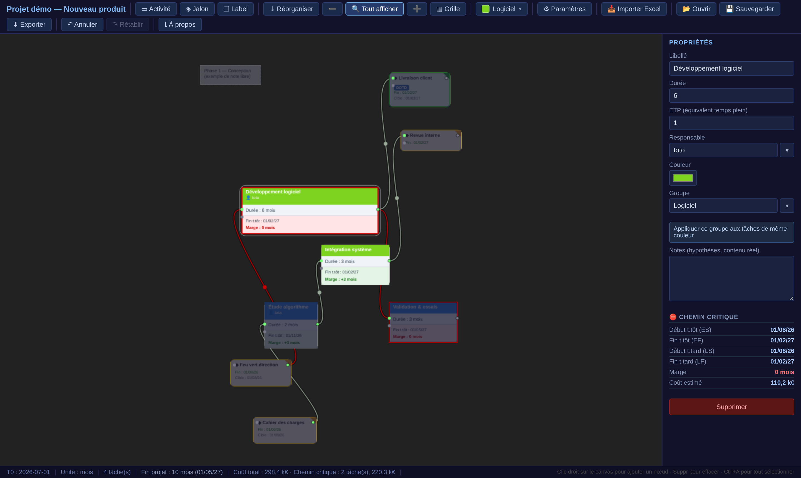

Le bouton **🔎 Filtre** met en évidence un sous-ensemble de tâches ; les autres nœuds sont
**estompés** (voile sombre). Vous pouvez filtrer par :

- **Groupe** (WP / métier / service) ;
- **Couleur** ;
- **Responsable**.

Le menu affiche une **pastille** de couleur (ou une icône 👤 pour les responsables) et un libellé
parlant. Choisissez « Aucun filtre » pour tout réafficher. Le filtre est un **état de vue** : il
n'est pas enregistré dans le fichier.

---

## 7. Regroupement métier (groupes et couleurs)

Un **groupe** (WP, métier, service…) permet de repérer d'un coup d'œil « qui fait quoi » sur un
grand planning. Le champ **Groupe** du panneau est une **liste enrichissable** : saisissez un
nouveau nom, ou choisissez-en un déjà utilisé.

- **« Le premier venu fixe la teinte »** : la première tâche à porter un nom de groupe
  enregistre **sa** couleur comme couleur du groupe ; les tâches suivantes du même groupe en
  **héritent** automatiquement. Les zones métier deviennent ainsi lisibles « de loin ».
- **Changer la couleur** d'une tâche groupée recolore **tout** le groupe.
- **Bouton « Appliquer ce groupe aux tâches de même couleur »** : rattache d'un clic toutes les
  tâches d'une même couleur au groupe courant — pratique pour taguer un lot importé.

---

## 8. Estimation des coûts

PertFlow fournit une **estimation de coût** par tâche, sans pour autant devenir un outil de
chiffrage : les montants restent **dans le panneau et la barre de statut**, jamais sur le nœud.

- **Coût d'une Activité** = (durée convertie en heures) × **ETP** × **taux horaire moyen**,
  affiché en **k€**. Le coût est **recalculé** (jamais figé) — il suit toujours les paramètres.
- **Paramètres de coût** (dans Paramètres) : **heures par mois**, **heures par jour**
  (la semaine = 5 jours), **taux horaire moyen**.
- **Barre de statut** : le **coût total du projet** (limité aux tâches **visibles** si un filtre
  est actif) et le **coût du chemin critique** courant.

Les **Jalons** et **Labels** n'ont pas de coût.

---

## 9. Importer un planning Excel existant

Le bouton **📥 Importer Excel** lit un planning issu de l'ancien outil Excel (`.xlsm`) et le
**concatène** au PERT courant (les nœuds importés s'ajoutent, ils ne remplacent rien).

- PertFlow lit la **feuille de configuration** du fichier (feuille cible, T0, unité) et reconstruit
  automatiquement les **nœuds** (activités, jalons, **jalons d'entrée**) et leurs **liens**.
- Un **dialogue** vous permet de choisir un **groupe** (existant ou nouveau) et la **couleur** à
  appliquer au lot importé, afin de le distinguer visuellement.
- Le placement d'origine est conservé ; utilisez **⤓ Réorganiser** si vous préférez un rangement
  automatique.

> Cette fonction est pensée pour récupérer les plannings historiques sans les ressaisir.

---

## 10. Sauvegarde, ouverture et récupération

### Fichier `.pert`

- **💾 Sauvegarder** télécharge votre projet dans un fichier **`.pert`** (format JSON).
- **📂 Ouvrir** recharge un `.pert`. Les dates et le chemin critique sont **recalculés** au
  chargement (cohérence garantie).

> ⚠️ En mode `file://`, c'est le **navigateur** qui gère le dossier de téléchargement : le fichier
> arrive dans votre dossier **Téléchargements**. Il n'est pas possible de choisir le dossier
> depuis l'application.

### Sauvegarde automatique (filet anti-plantage)

PertFlow conserve périodiquement une **copie de récupération** dans le navigateur. Après un
plantage, un **dialogue au démarrage** vous propose de **restaurer** votre travail non sauvegardé.

- Cette sauvegarde est **activée par défaut** (désactivable dans Paramètres).
- Elle **ne remplace pas** le fichier `.pert` : c'est un **filet de sécurité**, pas une
  sauvegarde définitive. Continuez à sauvegarder régulièrement votre `.pert`.

---

## 11. Exporter le planning

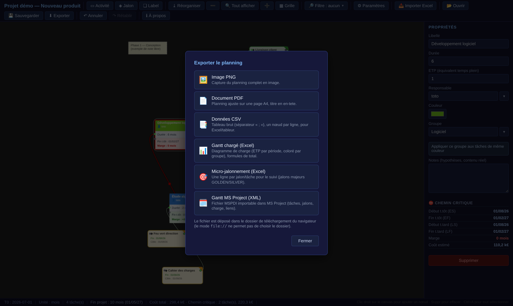

Le bouton **⬇ Exporter** ouvre une fenêtre proposant **six formats** :

| Format | Usage |
|---|---|
| **Image PNG** | Capture du planning complet en image. |
| **Document PDF** | Planning ajusté sur une page A4, avec le titre du projet. |
| **Données CSV** | Tableau brut (séparateur « ; »), un nœud par ligne, pour un tableur. |
| **Gantt chargé (Excel)** | Diagramme de charge : l'ETP par période, coloré par groupe, avec une ligne de total. |
| **Micro-jalonnement (Excel)** | Une ligne par jalon/tâche pour le suivi ; les jalons majeurs sont marqués **GOLDEN** (DOTD/COTD) ou **SILVER** (Ingénierie). |
| **Gantt MS Project (XML)** | Fichier importable dans MS Project (tâches, jalons, charge et **liens de dépendance**). |

Les exports **PNG** et **PDF** produisent le planning seul, sur fond blanc (indépendamment du
zoom courant à l'écran) :

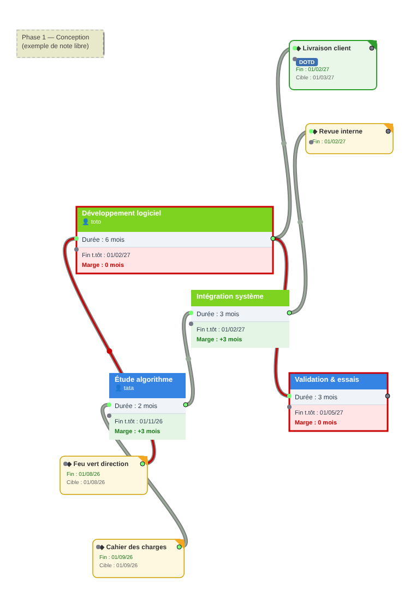

> Comme pour la sauvegarde, les fichiers exportés arrivent dans votre dossier **Téléchargements**
> (contrainte du mode `file://`).

---

## 12. Les paramètres du projet

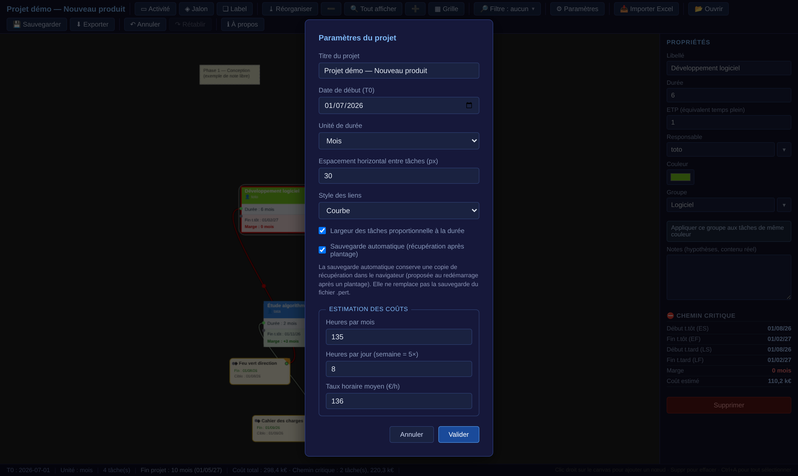

Le bouton **⚙ Paramètres** regroupe les réglages, tous **enregistrés** dans le `.pert` :

- **Titre du projet**.
- **Date de début (T0)** et **unité de durée** (jours / semaines / mois).
- **Espacement horizontal entre tâches** (utilisé par « Réorganiser »).
- **Style des liens** (courbe / droit / coudé — voir §6).
- **Largeur des tâches proportionnelle à la durée** (case à cocher).
- **Sauvegarde automatique** (case à cocher).
- **Estimation des coûts** : heures par mois, heures par jour, taux horaire moyen.

---

## 13. Raccourcis clavier

| Raccourci | Action |
|---|---|
| `Suppr` / `Retour arrière` | Supprimer le(s) nœud(s) sélectionné(s) |
| `Ctrl+Z` | Annuler |
| `Ctrl+Y` (ou `Ctrl+Maj+Z`) | Rétablir |
| `Ctrl+A` | Tout sélectionner |
| `Ctrl+C` / `Ctrl+V` | Copier / coller la sélection |
| `Ctrl+molette` | Zoom |

---

## 14. Questions fréquentes

**Puis-je utiliser PertFlow sans internet ?**
Oui, c'est même le mode prévu : double-clic sur `pertflow.html`, tout fonctionne hors ligne.

**Où sont enregistrés mes fichiers ?**
Dans le dossier **Téléchargements** de votre navigateur. En mode `file://`, l'application ne peut
pas choisir le dossier de destination.

**Une tâche est en rouge, est-ce une erreur ?**
Non : le rouge signale le **chemin critique** (marge nulle) ou une **échéance infaisable** (marge
négative). C'est une **information**, pas un bug.

**Pourquoi mon jalon de début ne part-il pas à T0 ?**
S'il s'agit d'un **jalon entrant** avec une date-cible (sans lien entrant), sa cible fixe
volontairement le démarrage de la chaîne aval (contrainte externe). Voir §4.

**Le chemin critique change quand je sélectionne une tâche, est-ce normal ?**
Oui : sans sélection, PertFlow montre le chemin de marge minimale ; avec une tâche sélectionnée,
il montre le chemin qui **contraint** cette tâche.

**Comment récupérer un ancien planning Excel ?**
Via **📥 Importer Excel** (voir §9).

---

*PertFlow — © Stéphane Guichard — Licence MIT.*
